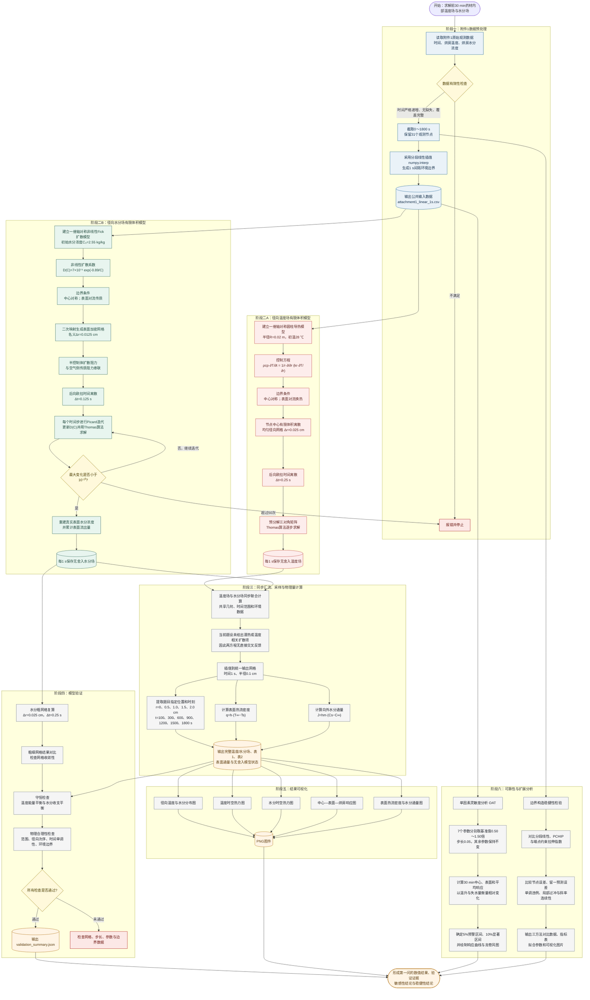

# A题第一问建模流程图

下面的 Mermaid 源码可直接在支持 Mermaid 的 Markdown 编辑器、Typora、Obsidian、GitHub 或 Mermaid Live Editor 中继续编辑。

## 阅读顺序

1. 附件1观测数据先经过完整性检查，再转换成统一的1秒分段线性边界。
2. 温度场和水分场分别求解；两者共享环境数据，但当前题设下没有直接交叉反馈项。
3. 两个场汇合后，统一提取题目表格、计算表面热流和水分通量。
4. 网格收敛性、守恒性和物理单调性共同构成模型验证。
5. 主结果进入可视化；同一边界数据还进入单因素灵敏度分析。
6. 原始观测节点进入三种拟合方法对比，用于评价边界构造方法的稳健性。

## 与五个程序的对应关系

| 流程阶段 | 对应程序 |
|---|---|
| 阶段一：数据预处理 | `data_preprocessing.py` |
| 阶段二至四：有限体积求解、结果采样与验证 | `fvm_model.py` |
| 阶段五：结果可视化 | `visualization.py` |
| 阶段六：参数灵敏度 | `sensitivity_analysis.py` |
| 阶段六：边界构造稳健性 | `robustness_check.py` |

> 注：代码与图中使用的标准算法名称为 PCHIP（Piecewise Cubic Hermite Interpolating Polynomial）。
