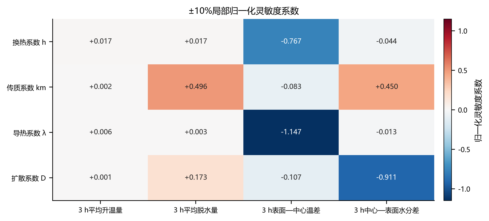
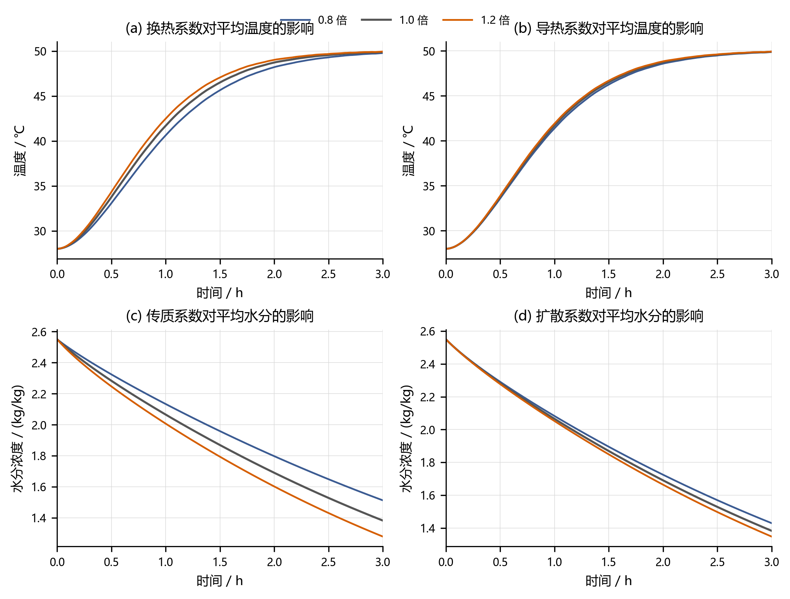
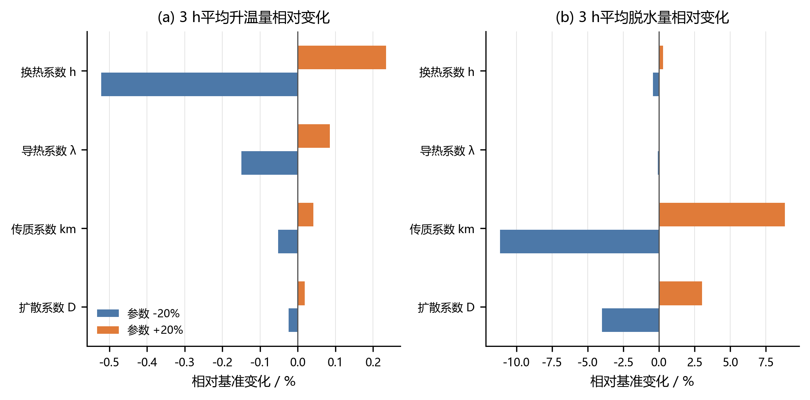

# A题第二问：水热耦合模型参数灵敏度分析

## 1. 分析目的

为评价第二问水热耦合模型的参数稳定性，考察表面对流换热、表面对流传质、内部导热和内部水分扩散参数发生变化时，药材温度场和水分场计算结果的变化幅度，并识别对结果影响最大的参数。

本分析使用第二问有限体积模型，保持烘房环境数据、药材半径、初始温度、初始水分和其余物性关系不变，每次只改变一个参数。

## 2. 扰动参数

选择以下四个参数或物性倍率：

| 参数 | 基准值 | 物理意义 |
|---|---:|---|
| 换热系数 $h$ | $25\ \mathrm{W/(m^2K)}$ | 控制空气与药材表面的显热交换 |
| 传质系数 $k_m$ | $8.0\times10^{-7}\ \mathrm{m/s}$ | 控制药材表面与空气的水分交换 |
| 导热系数倍率 $f_\lambda$ | 1.0 | 对 $\lambda(C)$ 整体乘以倍率 |
| 扩散系数倍率 $f_D$ | 1.0 | 对 $D(C,T)$ 整体乘以倍率 |

对每个参数采用

$$
f\in\{0.8,0.9,1.0,1.1,1.2\}
$$

五个水平，即在基准值附近进行 $-20\%,-10\%,0,+10\%,+20\%$ 的单因素扰动。

这里的 $\pm20\%$ 是用于检查模型响应的诊断范围，不代表参数的置信区间，也不表示参数真实误差一定为20%。

## 3. 分析指标

为了同时反映总体状态和空间均匀性，选取四个主要指标。

### 3.1 3小时平均升温量

$$
Y_T=\overline T(3\ \mathrm h)-T_0.
$$

### 3.2 3小时平均脱水量

$$
Y_C=C_0-\overline C(3\ \mathrm h).
$$

$Y_C$ 越大，说明3小时内总体脱水越充分。

### 3.3 3小时径向温差

$$
G_T=T_s(3\ \mathrm h)-T_c(3\ \mathrm h).
$$

$G_T$ 越小，温度场越均匀。

### 3.4 3小时径向水分差

$$
G_C=C_c(3\ \mathrm h)-C_s(3\ \mathrm h).
$$

$G_C$ 越大，说明中心与表面之间的水分梯度越明显。

## 4. 数值方案

灵敏度扫描采用80个向表面加密的径向控制体和 $1\ \mathrm s$ 时间步长。该方案是原模型的验证网格，其基准结果为

$$
\overline T(3\ \mathrm h)=49.9042\ ^\circ\mathrm C,
$$

$$
\overline C(3\ \mathrm h)=1.3826\ \mathrm{kg/kg}.
$$

原生产网格的3小时平均水分为 $1.3825\ \mathrm{kg/kg}$，两者差异很小。因此使用验证网格进行多情景扫描能够显著降低计算量，并足以识别本次参数影响排序。

基准指标为：

| 指标 | 基准结果 |
|---|---:|
| 3小时平均温度 | 49.9042 ℃ |
| 3小时平均水分 | 1.3826 kg/kg |
| 3小时平均升温量 $Y_T$ | 21.9042 ℃ |
| 3小时平均脱水量 $Y_C$ | 1.1674 kg/kg |
| 3小时径向温差 $G_T$ | 0.1170 ℃ |
| 3小时径向水分差 $G_C$ | 0.7582 kg/kg |

## 5. 归一化灵敏度系数

采用 $\pm10\%$ 中心差分估计局部归一化灵敏度系数：

$$
\boxed{
S_{Y,p}
=\frac{p_0}{Y_0}\frac{\partial Y}{\partial p}
\approx
\frac{Y(1.1p_0)-Y(0.9p_0)}{0.2Y_0}
}.
$$

其含义为：参数相对变化1%时，目标量在基准点附近大约相对变化 $S_{Y,p}\%$。

- $S>0$：参数增大使指标增大；
- $S<0$：参数增大使指标减小；
- $|S|$ 越大：指标对该参数越敏感。

计算结果如下：

| 参数 | 平均升温量 $Y_T$ | 平均脱水量 $Y_C$ | 温差 $G_T$ | 水分差 $G_C$ |
|---|---:|---:|---:|---:|
| 换热系数 $h$ | +0.017 | +0.017 | -0.767 | -0.044 |
| 传质系数 $k_m$ | +0.002 | +0.496 | -0.083 | +0.450 |
| 导热系数 $\lambda$ | +0.006 | +0.003 | -1.147 | -0.013 |
| 扩散系数 $D$ | +0.001 | +0.173 | -0.107 | -0.911 |

## 6. 参数变化下的3小时结果

| 参数 | 倍率 | 3小时平均温度/℃ | 3小时平均水分/(kg/kg) | 3小时径向温差/℃ | 3小时径向水分差/(kg/kg) |
|---|---:|---:|---:|---:|---:|
| 基准 | 1.0 | 49.9042 | 1.3826 | 0.1170 | 0.7582 |
| $h$ | 0.8 | 49.7900 | 1.3875 | 0.1451 | 0.7670 |
| $h$ | 1.2 | 49.9557 | 1.3792 | 0.1058 | 0.7530 |
| $k_m$ | 0.8 | 49.8929 | 1.5128 | 0.1193 | 0.6808 |
| $k_m$ | 1.2 | 49.9133 | 1.2795 | 0.1153 | 0.8185 |
| $\lambda$ | 0.8 | 49.8715 | 1.3834 | 0.1533 | 0.7608 |
| $\lambda$ | 1.2 | 49.9230 | 1.3821 | 0.0962 | 0.7565 |
| $D$ | 0.8 | 49.8989 | 1.4292 | 0.1199 | 0.9210 |
| $D$ | 1.2 | 49.9083 | 1.3474 | 0.1148 | 0.6402 |

## 7. 参数增减20%的相对影响

### 7.1 对3小时平均升温量的影响

| 参数 | 参数降低20% | 参数提高20% |
|---|---:|---:|
| $h$ | -0.521% | +0.235% |
| $k_m$ | -0.052% | +0.041% |
| $\lambda$ | -0.150% | +0.086% |
| $D$ | -0.024% | +0.019% |

### 7.2 对3小时平均脱水量的影响

| 参数 | 参数降低20% | 参数提高20% |
|---|---:|---:|
| $h$ | -0.425% | +0.288% |
| $k_m$ | -11.154% | +8.834% |
| $\lambda$ | -0.068% | +0.045% |
| $D$ | -3.993% | +3.011% |

参数正负扰动的结果并不完全对称，说明模型具有一定非线性，不能用单一线性系数精确描述整个 $\pm20\%$ 区间。

## 8. 结果分析

### 8.1 平均温度对参数变化总体稳定

四个参数发生 $\pm20\%$ 变化时，3小时平均温度始终位于

$$
49.7900\sim49.9557\ ^\circ\mathrm C
$$

范围内，最大跨度约 $0.166\ ^\circ\mathrm C$。说明在3小时末，药材温度已经接近烘房温度，最终平均温度对参数误差较稳健。

但这不代表全过程都不敏感。响应曲线显示，换热系数对约0.5～2小时的升温速度影响较明显，只是在3小时接近平衡后差异逐渐缩小。因此，如果论文只比较3小时终值，会低估换热系数对前期升温过程的影响。

### 8.2 换热系数是平均升温量的首要参数

平均升温量对换热系数的局部灵敏度为

$$
S_{Y_T,h}=0.017,
$$

在四个参数中最大。提高 $h$ 会增强空气向药材表面的显热输入，使药材升温更快；温度升高又会增大 $D(C,T)$，因此还会产生小幅促进脱水的交叉效应。

### 8.3 导热系数主要控制内部温度均匀性

温差对导热系数的灵敏度为

$$
S_{G_T,\lambda}=-1.147,
$$

其绝对值在温差指标中最大。导热系数提高20%时，3小时径向温差由 $0.1170\ ^\circ\mathrm C$ 降至 $0.0962\ ^\circ\mathrm C$；降低20%时则增至 $0.1533\ ^\circ\mathrm C$。

因此，导热系数对最终平均温度的影响不大，但对中心和表面之间的温度均匀性影响显著。这说明平均值和空间梯度必须同时进行灵敏度分析。

### 8.4 传质系数是平均脱水量的首要参数

平均脱水量的灵敏度排序为

$$
k_m>D>h>\lambda.
$$

其中

$$
S_{Y_C,k_m}=0.496,
$$

明显高于其他参数。$k_m$ 降低20%时，3小时平均水分升至 $1.5128\ \mathrm{kg/kg}$；提高20%时降至 $1.2795\ \mathrm{kg/kg}$。

这说明在当前基准参数附近，外部表面对流传质阻力仍然重要，不能把整个干燥过程简单解释为只由内部扩散控制。

### 8.5 扩散系数主要控制内部水分均匀性

水分差对扩散系数的灵敏度为

$$
S_{G_C,D}=-0.911.
$$

当 $D$ 提高20%时，中心—表面水分差由 $0.7582$ 降至 $0.6402\ \mathrm{kg/kg}$；当 $D$ 降低20%时则增至 $0.9210\ \mathrm{kg/kg}$。

扩散系数增大能够加快中心水分向表面的补给，使内部水分场更均匀，并提高总体脱水量。

### 8.6 传质系数增大可能强化内部水分梯度

水分差对传质系数的灵敏度为正：

$$
S_{G_C,k_m}=0.450.
$$

提高 $k_m$ 会使表面水分更快排出，但中心水分向表面的扩散速度受到内部扩散系数限制，因此表面降低速度快于中心，反而形成更大的中心—表面水分差。

这并不表示提高传质系数不利于干燥，而是说明更强的外部传质会将控制瓶颈进一步推向药材内部。

### 8.7 水分参数对温度的交叉影响较弱

$k_m$ 和 $D$ 对平均温度的灵敏度分别只有 $0.0023$ 和 $0.0011$。原因是本问不考虑蒸发潜热，水分对温度的影响只能通过 $\rho(C)$、$c_p(C)$ 和 $\lambda(C)$ 间接实现。

如果后续加入蒸发潜热，传质系数和扩散系数对温度的交叉灵敏度预计会明显增大。

## 9. 综合灵敏度排序

不同输出指标对应不同的关键参数：

| 研究目标 | 灵敏度排序 |
|---|---|
| 3小时平均升温量 | $h>\lambda>k_m>D$ |
| 3小时平均脱水量 | $k_m>D>h>\lambda$ |
| 3小时温度均匀性 | $\lambda>h>D>k_m$ |
| 3小时水分均匀性 | $D>k_m>h>\lambda$ |

因此不存在对所有输出都占主导的单一参数：

- 温度平均响应主要由表面对流换热控制；
- 温度空间均匀性主要由内部导热控制；
- 总体脱水量主要由表面对流传质控制；
- 水分空间均匀性主要由内部水分扩散控制。

## 10. 对参数测定和模型改进的建议

1. 应优先准确测定或反演传质系数 $k_m$，因为它对总体脱水量最敏感。
2. 应重点校准扩散系数公式及其温度、水分依赖关系，因为它决定内部水分梯度。
3. 若研究前期升温速度，应提高换热系数 $h$ 的测定精度。
4. 若研究药材中心与表面的温差，则应准确测定导热系数 $\lambda(C)$。
5. 后续加入蒸发潜热后，需要重新进行灵敏度分析，当前交叉影响排序可能发生变化。

## 11. 分析边界与局限

1. 本分析属于单因素局部灵敏度分析，没有同时改变多个参数，因此不能识别参数交互效应。
2. $\pm20\%$ 为人为设定的诊断区间，不是实验统计得到的参数分布。
3. 灵敏度扫描使用验证网格，而不是每个情景都使用160控制体、0.5秒步长的生产网格。
4. 当前模型不考虑蒸发潜热，因此水分参数对温度的影响可能被低估。
5. 当前传质边界直接比较药材水分与空气水分，若二者物理定义不同，$k_m$ 将同时吸收边界状态转换误差。
6. 局部灵敏度系数只反映基准点附近的斜率，不能代替全局不确定性分析。

如果后续获得参数概率分布或实验标定区间，可进一步采用Latin超立方抽样、Morris筛选或Sobol全局灵敏度分析，量化参数交互和输出方差贡献。

## 12. 数据、代码与图片

- 灵敏度分析代码：[`a2_sensitivity_analysis.py`](../code/a2_sensitivity_analysis.py)
- 参数化后的第二问求解器：[`a2_coupled_fvm.py`](../code/a2_coupled_fvm.py)
- 各情景终值：[`sensitivity_metrics.csv`](../results/A_problem2_sensitivity/sensitivity_metrics.csv)
- 全过程60秒采样结果：[`sensitivity_trajectories_60s.csv`](../results/A_problem2_sensitivity/sensitivity_trajectories_60s.csv)
- 局部灵敏度系数：[`local_elasticity.csv`](../results/A_problem2_sensitivity/local_elasticity.csv)
- 完整摘要：[`sensitivity_summary.json`](../results/A_problem2_sensitivity/sensitivity_summary.json)

