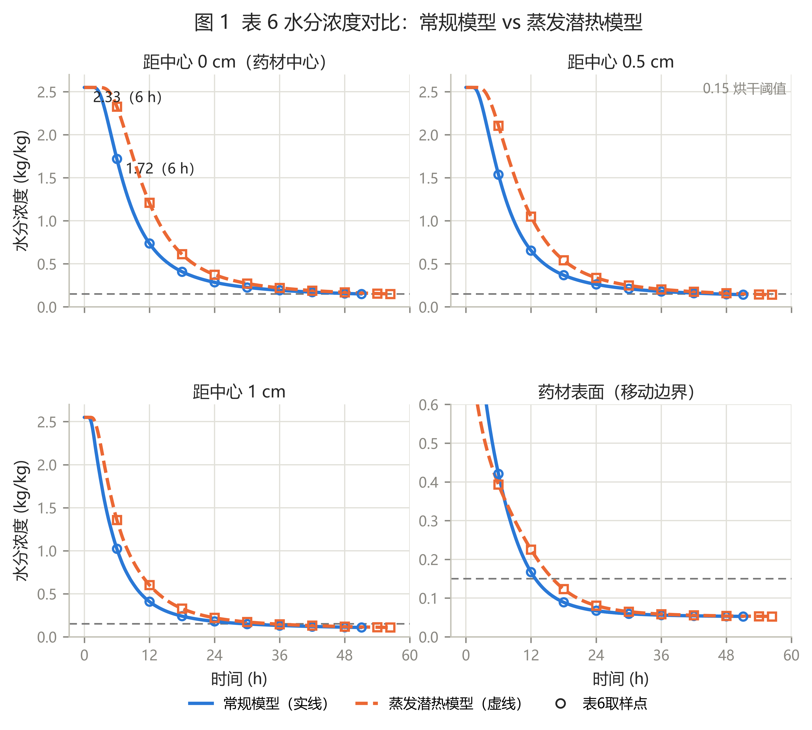
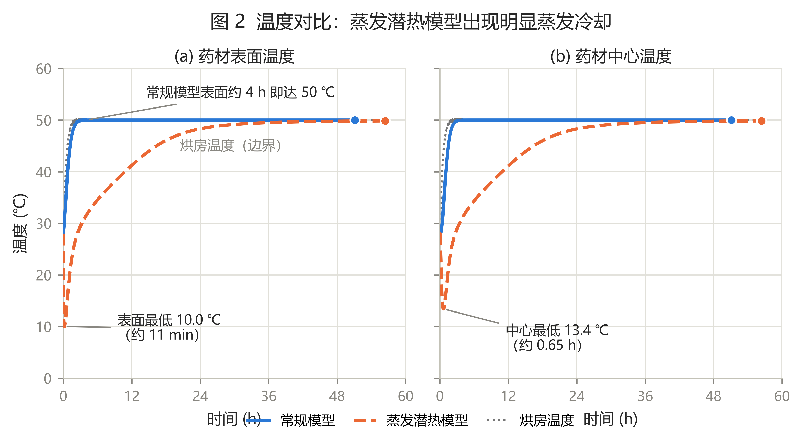
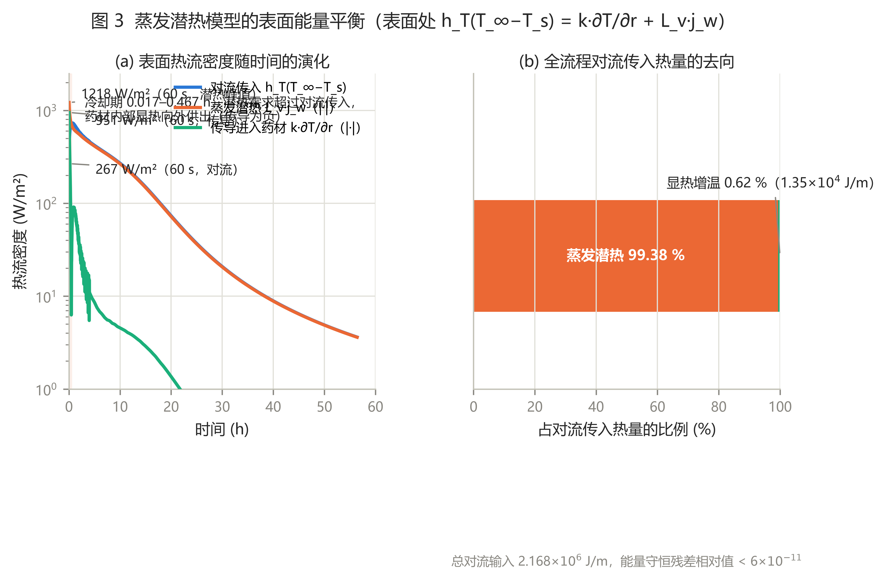
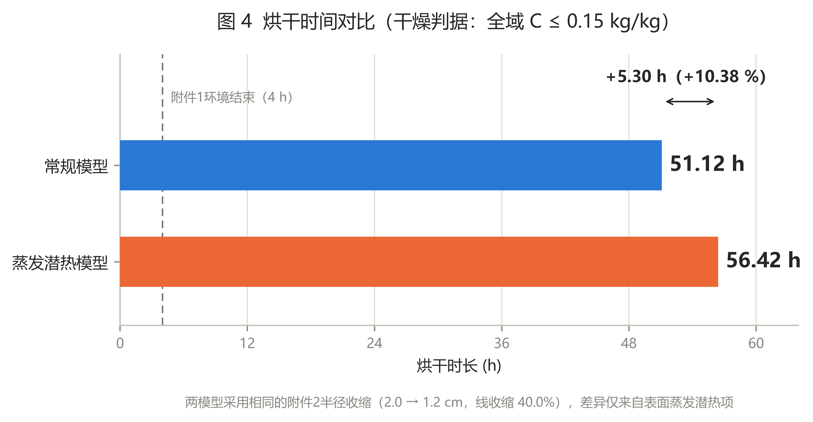

# A 题第四问：考虑蒸发潜热模型的对比分析与可视化

本文对第四问的两个模型结果进行对比分析：**常规模型**（`results/A_problem4_shrinkage/`，与问题 1–3 一致、不计相变潜热）与**蒸发潜热模型**（`results/A_problem4_shrinkage_steam/`，在移动表面能量平衡中加入蒸发潜热汇 `L_v·j_w`）。全部图形由 `code/a4_steam_comparison_visualization.py` 生成，只读取正式数值结果，不重新求解、不平滑数据。

## 1 两个模型的唯一差异

两模型共用同一套物理设定：附件 2 的半径分段线性收缩（2.0 → 1.2 cm，线收缩 40.0%）、附录 4 的全部热物性与水分扩散系数、相同的传热传质系数（`h_T = 25 W/(m²·K)`、`h_m = 8×10⁻⁷ m/s`）、相同的干燥判据（全域水分浓度 `C ≤ 0.15 kg/kg`）。唯一差异在**药材移动表面的能量平衡**：

| 模型 | 表面能量平衡 | 潜热项 |
|---|---|---|
| 常规模型 | `h_T(T_∞ − T_s) = k·∂T/∂r` | 无（对流传入的热量全部用于药材显热增温） |
| 蒸发潜热模型 | `h_T(T_∞ − T_s) = k·∂T/∂r + L_v·j_w` | `L_v = (2500.8 − 2.36·T_s(℃)) × 10³ J/kg`，`j_w = ρ_{d,s}·h_m·(C_s − C_∞)`，`ρ_{d,s} = (760 + 90C_s)/(1 + C_s)` 随表面含水率动态更新 |

即：表面每蒸发 1 kg 水，就要从表面能量平衡中扣除约 2.4–2.5 MJ 的热量。

## 2 表 6 数据对比（图 1）



图 1 以 2×2 小倍数直接呈现两模型表 6 的数值（实线/虚线为 60 s 分辨率的完整时间曲线，空心圆/方块为表 6 每 6 h 取样点）：

- **药材内部（中心、0.5 cm、1 cm）**：同一时刻蒸发潜热模型的水分浓度显著更高。6 h 时中心处为 2.3272 kg/kg，比常规模型的 1.7198 kg/kg 高 **+35.3%**；12 h 时中心处高出 **+63.9%**（0.7382 → 1.2099）。内部“湿区”滞留时间明显变长。
- **药材表面**：6 h 时蒸发潜热模型表面反而更干（0.3934 vs 0.4208，**−6.5%**），但 12 h 后反转为更湿（0.2255 vs 0.1671，+34.9%）。
- **终态一致**：两模型烘干结束时刻的剖面几乎完全相同（中心 0.1500、0.5 cm 处 0.1413、1 cm 处 0.1081、表面 0.0526）。差别不在“终点长什么样”，而在“多久走到终点”。

完整数值对照（含相对差）见 `result/A_q4_steam_comparison/table6_comparison.csv`，要点摘录如下：

| 时间/h | 位置 | 常规模型 | 蒸发潜热模型 | 相对差 |
|---|---|---|---|---|
| 6 | 中心 | 1.7198 | 2.3272 | +35.3% |
| 6 | 表面 | 0.4208 | 0.3934 | −6.5% |
| 12 | 中心 | 0.7382 | 1.2099 | +63.9% |
| 12 | 表面 | 0.1671 | 0.2255 | +34.9% |
| 24 | 中心 | 0.2853 | 0.3745 | +31.3% |
| 48 | 中心 | 0.1562 | 0.1691 | +8.3% |
| 烘干结束 | 中心 | 0.1500 | 0.1500 | 0.0% |

## 3 温度对比：蒸发冷却效应（图 2）



图 2 是两模型最直观的差异：

- **常规模型**：表面温度从 28 ℃ 单调上升，约 4 h 内即达 50 ℃ 并与烘房温度持平；中心温度同步升至 50 ℃，全流程不存在任何冷却。
- **蒸发潜热模型**：表面温度在最初 11 min 内从 28 ℃ **骤降至 10.0 ℃**（0.183 h 达到最低点 10.02 ℃），随后随水分通量衰减缓慢回升：6 h 时 34.6 ℃、12 h 时 41.2 ℃、24 h 时 48.3 ℃、烘干结束时 49.85 ℃。冷却波向内传播，中心温度在 0.65 h 时降至最低 13.4 ℃。表面与中心的径向温差初期可达 14–16 ℃（0.10 h 时最大 16.5 ℃），0.65 h 后中心反而比表面更冷（冷却波已抵达中心、表面先行回升），是“潜热汇驱动”的典型特征。

这一现象是潜热项的必然结果：初期水分通量最大（`j_w ≈ 4.96×10⁻⁴ kg/(m²·s)`），对应潜热需求约 1218 W/m²，远超当时约 267 W/m² 的对流传入量，差额只能从药材自身显热中抽取，因此表面被强制冷却到由蒸发速率决定的低平衡温度（接近湿球温度的概念）。

## 4 表面能量平衡（图 3）



图 3(a) 给出蒸发潜热模型表面三项热流密度的时间演化：

- **蒸发潜热通量 `L_v·j_w`** 在 60 s 时达到峰值 **1218.3 W/m²**，随后单调衰减至 3.6 W/m²；
- **对流传入 `h_T(T_∞−T_s)`** 在 60 s 时仅 267.4 W/m²，约 0.68 h 达峰值 733 W/m²；
- **传导进入药材 `k·∂T/∂r`** 在 **0.017–0.467 h（约 1–28 min）内为负**（60 s 时为 −950.9 W/m²），即热量从药材内部倒流至表面供给蒸发——这正是表面与中心温度骤降的定量来源。0.467 h 后传导转正，药材开始净吸热。

图 3(b) 给出全流程对流传入热量的去向：**99.38% 被表面蒸发潜热消耗（2.1542×10⁶ J/m），仅 0.62%（1.35×10⁴ J/m）用于药材显热增温**。表面能量平衡残差相对值小于 6×10⁻¹¹、内部显热存储平衡残差相对值小于 1.1×10⁻⁸，模型能量守恒闭合良好。交叉验证：全流程蒸发水分为 0.8886 kg/m，潜热积分与水分的比值为 2.424 MJ/kg，落在 `L_v` 经验式取值区间（2.383–2.459 MJ/kg）内，自洽。

## 5 烘干时间对比（图 4）



- 常规模型：**51.117 h**；
- 蒸发潜热模型：**56.421 h**，延长 **5.304 h，相对增幅 +10.38%**。

两模型粗细网格对照的干燥时间差均为 4 s，离散水分守恒残差均在 10⁻¹³ 量级，上述差距不是数值误差，而是潜热项的物理效应。

## 6 考虑蒸发后的结果变化与机理分析

**机理链条**（用数据闭环验证）：

1. **潜热汇冷却表面**（图 2、图 3）：表面蒸发需要热量，初期潜热需求超过对流传入，药材内部显热被抽走，表面温度 28 → 10 ℃、中心 28 → 13.4 ℃。
2. **低温压低水分扩散系数**：附录 4 的 `D = 4.2×10⁻⁴·exp(−0.30/C)·exp(−3850/T)` 对温度呈强 Arrhenius 依赖。10 ℃（283 K）相对 28 ℃（301 K），`exp(−3850/T)` 因子下降约 2.3 倍；蒸发潜热模型全流程扩散系数范围为 9.3×10⁻¹²–1.58×10⁻⁹ m²/s，上限明显低于常规模型的 2.48×10⁻⁹ m²/s。
3. **内部扩散成为瓶颈**：表面水分通量受传质系数 `h_m` 限制，而表面含水率 `C_s` 由内部水分向表面的扩散供给决定。低温使内部供给变慢，表面“干得快、供不上”——这正是表 6 中 **6 h 时蒸发潜热模型表面更干（−6.5%）而内部更湿（+35.3%）**的原因：水分被堵在内部，梯度更陡。
4. **整体干燥推迟**：内部湿区滞留使满足“全域 `C ≤ 0.15 kg/kg`”的时刻后移 5.3 h。由于干燥判据由最慢点（中心）控制，内部扩散被抑制直接转化为烘干时长增加 +10.38%。
5. **终态剖面不变**：两模型终态水分剖面几乎相同（判据、边界与收缩路径均相同），差异全部体现在时间轴上。

**其他值得注意的变化**：

- 蒸发潜热模型的表面干基密度随含水率动态变化（313.8 → 726.5 kg/m³），初始参考值 278.7 kg/m³ 与附录 4 公式一致；
- 初期（0–28 min）表面温度低于烘房露点附近温度，药材表面相当于处于“强制蒸发冷却”状态，工艺上对应恒温段前端的强烈失水段，这也是实际烘房中回风温度低于设定值、药材表面结露/低温阶段的物理来源；
- 能量去向表明该工艺的能量几乎全部用于蒸发水分（99.38%），显热占比极小，说明“多通风、快排湿”比“高温度”更能缩短干燥时间——但温度过低又会通过 `D(T)` 拖慢内部扩散，存在最优工艺温度区间。

## 7 结论

1. 考虑蒸发潜热后，第四问烘干时长由 51.117 h 增至 **56.421 h（+5.304 h，+10.38%）**，两模型终态剖面一致。
2. 蒸发潜热模型再现了常规模型缺失的**蒸发冷却效应**：表面最低 10.0 ℃、中心最低 13.4 ℃，初期 1–28 min 内药材向表面倒流供热。
3. 全流程对流传入热量 **99.38% 被蒸发潜热消耗**，显热仅占 0.62%，能量平衡残差小于 6×10⁻¹¹。
4. 干燥变慢的机理是：潜热汇冷却 → `D(T)` 降低约 2.3 倍 → 内部扩散成为瓶颈 → 中心湿区滞留 → 达到干燥判据的时刻后移。表 6 中“表面更干、内部更湿”的形态特征是该机理的直接证据。
5. 若论文需要体现建模深度，建议采用蒸发潜热模型作为第四问正式结果，并选用图 1、图 2（或图 3、图 4 中的 1–2 张）及第 2 节对照表说明潜热项的影响；常规模型结果可作为敏感性对照。

## 附：复现方式

```powershell
python code/a4_shrinkage_fvm.py        # 常规模型（已有结果）
python code/a4_shrinkage_fvm_steam.py  # 蒸发潜热模型（已有结果）
python code/a4_steam_comparison_visualization.py  # 本文全部图形与对照表
```

输出：`picture/A_q4_steam_comparison/*.png`、`result/A_q4_steam_comparison/comparison_metrics.json`、`result/A_q4_steam_comparison/table6_comparison.csv`。
